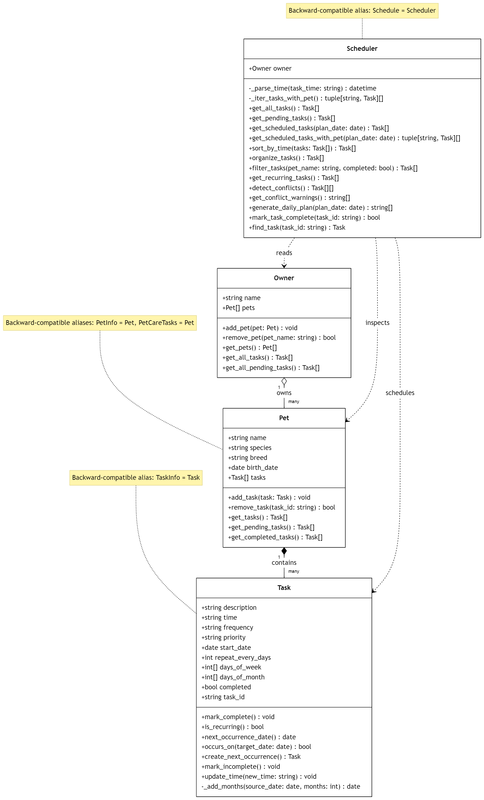

# PawPal+ (Module 2 Project)

You are building **PawPal+**, a Streamlit app that helps a pet owner plan care tasks for their pet.

## Scenario

A busy pet owner needs help staying consistent with pet care. They want an assistant that can:

- Track pet care tasks (walks, feeding, meds, enrichment, grooming, etc.)
- Consider constraints (time available, priority, owner preferences)
- Produce a daily plan and explain why it chose that plan

Your job is to design the system first (UML), then implement the logic in Python, then connect it to the Streamlit UI.

## What you will build

Your final app should:

- Let a user enter basic owner + pet info
- Let a user add/edit tasks (time + priority at minimum)
- Generate a daily schedule/plan based on constraints and priorities
- Display the plan clearly (and ideally explain the reasoning)
- Include tests for the most important scheduling behaviors

## Getting started

### Setup

```bash
python -m venv .venv
source .venv/bin/activate  # Windows: .venv\Scripts\activate
pip install -r requirements.txt
```

### Suggested workflow

1. Read the scenario carefully and identify requirements and edge cases.
2. Draft a UML diagram (classes, attributes, methods, relationships).
3. Convert UML into Python class stubs (no logic yet).
4. Implement scheduling logic in small increments.
5. Add tests to verify key behaviors.
6. Connect your logic to the Streamlit UI in `app.py`.
7. Refine UML so it matches what you actually built.

## 🖥️ Sample Output

Running `python main.py` loads (or seeds) `data.json`, then prints a priority-ordered,
color-coded schedule. Note how the three **🔴 High** tasks lead the list even though a
lower-priority task (`09:00 Litter box cleanup`) is earlier in the day — this is the
priority-first scheduling from Challenge 3:

```
Seeded a new owner and saved it to data.json.

🐾 Today's Schedule (priority, then time)
========================================
╭────┬────────┬───────┬────────────────────┬────────────┬─────────┬────────────╮
│    │ Time   │ Pet   │ Task               │ Priority   │ Freq    │ Status     │
├────┼────────┼───────┼────────────────────┼────────────┼─────────┼────────────┤
│ ✂️ │ 07:30  │ Luna  │ Grooming brush     │ 🔴 High    │ weekly  │ ⏳ Pending │
├────┼────────┼───────┼────────────────────┼────────────┼─────────┼────────────┤
│ 💊 │ 08:00  │ Mochi │ Medication         │ 🔴 High    │ daily   │ ⏳ Pending │
├────┼────────┼───────┼────────────────────┼────────────┼─────────┼────────────┤
│ 🍽️ │ 08:00  │ Mochi │ Morning feeding    │ 🔴 High    │ daily   │ ⏳ Pending │
├────┼────────┼───────┼────────────────────┼────────────┼─────────┼────────────┤
│ 🪲 │ 10:00  │ Mochi │ Flea treatment     │ 🟡 Medium  │ once    │ ⏳ Pending │
├────┼────────┼───────┼────────────────────┼────────────┼─────────┼────────────┤
│ 🐕 │ 18:30  │ Luna  │ Evening walk       │ 🟡 Medium  │ daily   │ ⏳ Pending │
├────┼────────┼───────┼────────────────────┼────────────┼─────────┼────────────┤
│ 🧹 │ 09:00  │ Mochi │ Litter box cleanup │ 🟢 Low     │ daily   │ ⏳ Pending │
├────┼────────┼───────┼────────────────────┼────────────┼─────────┼────────────┤
│ 🐾 │ 11:00  │ Mochi │ Nail trim          │ 🟢 Low     │ monthly │ ⏳ Pending │
╰────┴────────┴───────┴────────────────────┴────────────┴─────────┴────────────╯
Note: high-priority tasks lead the list even when a lower-priority task is earlier in the day.

📋 Readable plan
===============
✂️ 07:30 - Luna: Grooming brush [priority: high]
💊 08:00 - Mochi: Medication [priority: high]
🍽️ 08:00 - Mochi: Morning feeding [priority: high]
🪲 10:00 - Mochi: Flea treatment [priority: medium]
🐕 18:30 - Luna: Evening walk [priority: medium]
🧹 09:00 - Mochi: Litter box cleanup [priority: low]
🐾 11:00 - Mochi: Nail trim [priority: low]

⚠️  Time conflicts
==================
Warning: 08:00 has 2 overlapping tasks for Mochi: Morning feeding, Medication

🕒 Next available slot
=====================
Searching from 08:00 (which is taken), the next open slot is: 08:30

🔁 Recurrence demo (in-memory, not persisted)
============================================
Completed 'Litter box cleanup' (2026-07-06); task count 7 -> 8. Next occurrence auto-created for 2026-07-07.
```

On a **second run**, `main.py` prints `Loaded existing owner from data.json.` instead of
re-seeding — the pets and tasks survived because they were persisted to disk.

## 🧪 Testing PawPal+

Run the test suite with:

```bash
python -m pytest
```

The tests cover the core scheduler behaviors plus the stretch features: chronological
sorting, **priority-first ordering**, recurring task completion, duplicate-time conflict
detection, filtering, date-based scheduling, **JSON persistence round-trips**, and the
**next-available-slot** search.

Successful test run output:

```text
============================= test session starts ==============================
platform linux -- Python 3.12.1, pytest-9.1.1, pluggy-1.6.0
rootdir: /workspaces/ai110-module2show-pawpal-starter
plugins: anyio-4.14.0
collected 15 items

tests/test_pawpal.py ...............                                     [100%]

============================== 15 passed in 0.06s ==============================
```

Confidence Level: ★★★★★

## 📐 Smarter Scheduling

| Feature | Method(s) | Notes |
|---------|-----------|-------|
| **Priority-first sorting** | `Scheduler.sort_by_time()`, `Task.priority_rank()` | Sorts by priority (High → Medium → Low) first, then parsed time, with frequency/description tie-breakers. |
| Filtering | `Scheduler.filter_tasks()` | Filters tasks by pet name and/or completion status before building a display list. |
| Conflict handling | `Scheduler.get_conflict_warnings()` | Detects same-time overlaps and returns warning strings instead of crashing. |
| Recurring tasks | `Task.occurs_on()`, `Task.next_occurrence_date()`, `Task.create_next_occurrence()` | Handles daily, weekly, monthly, and every-n-days recurrence rules when deciding what appears on a date. |
| **Next available slot** | `Scheduler.find_next_available_slot()` | Advanced capability: walks a working window in fixed increments and returns the first open time not already taken. |
| **Data persistence** | `Owner.save_to_json()` / `Owner.load_from_json()`, `*.to_dict()` / `*.from_dict()` | Serializes the owner → pets → tasks tree to `data.json` and rebuilds it on the next run. |
| **Formatted output** | `Task.display_icon()`, `main.priority_badge()`, `main.status_badge()`, `main.render_table()` | Emoji-per-task-type, color-coded priority/status badges, and `tabulate` boxed tables. |

## ⭐ Priority Scheduling (Stretch)

Every `Task` carries a **priority** of `high`, `medium`, or `low` (the legacy value
`normal` is normalized to `medium` in `Task.__post_init__`). `Scheduler.sort_by_time()`
sorts by `Task.priority_rank()` **first**, then by parsed time. The effect is visible in
the CLI output above: all **🔴 High** tasks appear before any Medium/Low task, and only
within the same priority band does the clock decide the order — so `09:00 Litter box
cleanup` (Low) is listed *after* `18:30 Evening walk` (Medium).

```
Priority   Time    Task
🔴 High    07:30   Grooming brush     ← high tasks first, regardless of clock time
🔴 High    08:00   Medication
🔴 High    08:00   Morning feeding
🟡 Medium  10:00   Flea treatment
🟡 Medium  18:30   Evening walk       ← later in the day, but outranks the Low task below
🟢 Low     09:00   Litter box cleanup ← earlier clock time, but lowest priority
🟢 Low     11:00   Nail trim
```

## 💾 Data Persistence (Stretch)

PawPal+ remembers pets and tasks between runs by serializing them to a JSON file.

- **How it works:** `Owner.to_dict()` / `Pet.to_dict()` / `Task.to_dict()` convert the
  object tree into JSON-safe dictionaries (dates become ISO strings, tuples become lists).
  `Owner.save_to_json("data.json")` writes them to disk; `Owner.load_from_json("data.json")`
  reads them back via the matching `from_dict()` class methods, returning an empty `Owner`
  if the file is missing or corrupt. No external library is needed — a custom dictionary
  conversion layer keeps the format transparent and dependency-free.
- **Workflow:** `main.py` calls `load_from_json()` on startup; if no pets exist it seeds a
  demo owner and calls `save_to_json()`. `app.py` loads the owner into `st.session_state`
  once and re-saves after every add-pet / add-task action, so the browser session and the
  CLI share the same `data.json`.
- **Files modified:** `pawpal_system.py` (serialization + save/load), `main.py` and
  `app.py` (load-on-start / save-on-change), `.gitignore` (ignores the generated
  `data.json`).

## 🎨 Output Formatting (Stretch)

The CLI demo uses professional, human-friendly formatting:

- **Emojis per task type** — `Task.display_icon()` maps keywords in the description to an
  emoji (🍽️ feeding, 💊 medication, 🐕 walk, ✂️ grooming, 🧹 litter, 🪲 flea, 🎾 play, 🐾 default).
- **Color-coded badges** — `priority_badge()` renders `🔴 High` / `🟡 Medium` / `🟢 Low`
  and `status_badge()` renders `✅ Done` / `⏳ Pending` (in `main.py`).
- **Structured tables** — `render_table()` uses the [`tabulate`](https://pypi.org/project/tabulate/)
  library (`tablefmt="rounded_grid"`) for boxed CLI tables, with a plain-text fallback if
  `tabulate` is not installed. Install it via `pip install -r requirements.txt`.

## 📸 Demo Walkthrough

### Main UI features

The Streamlit app ([app.py](app.py)) is organized into stacked sections, each backed by the `Owner`/`Pet`/`Task`/`Scheduler` classes:

- **Adding a Pet** — enter a name, species, and breed to create a `Pet`. The owner lives in `st.session_state` and is saved to `data.json`, so pets persist across reruns *and* app restarts.
- **Scheduling a Task** — pick a pet, then add a task with a description, time, frequency (`once` / `daily` / `weekly`), and priority (`low` / `medium` / `high`). Each pet's tasks render in a priority-then-time ordered table.
- **Today's Schedule** — choose a date and see only the tasks that actually occur that day, ordered by priority then time, plus a readable "plan" line per task and the next available slot. Same-time collisions surface as `st.warning` banners.
- **Filtered Tasks** — filter across all pets by pet name and by completion status (all / pending / completed).

### Example workflow

1. In **Adding a Pet**, add `Mochi` (cat) and `Luna` (dog).
2. In **Scheduling a Task**, give Mochi a daily `Morning feeding` at `08:00` and `Medication` at `08:00`, and Luna an `Evening walk` at `18:30`.
3. Open **Today's Schedule** — tasks appear sorted by time, and a conflict banner warns that Mochi has two tasks at `08:00`.
4. Use **Filtered Tasks** to show only Mochi's pending tasks.
5. Mark a daily task complete and confirm a fresh copy is auto-created for the next day.

### Key Scheduler behaviors shown

- **Priority-first sorting** via `Scheduler.sort_by_time()` / `Task.priority_rank()` (handles both `HH:MM` and `HH:MM AM/PM`).
- **Conflict warnings** via `Scheduler.get_conflict_warnings()` — same-time tasks produce a readable warning instead of crashing.
- **Date-aware scheduling** via `Scheduler.get_scheduled_tasks_with_pet()` / `Task.occurs_on()` — only tasks due on the selected date are shown.
- **Next available slot** via `Scheduler.find_next_available_slot()`.
- **Recurrence** — completing a daily/weekly/monthly task auto-creates its next occurrence (`Task.create_next_occurrence()`).

### Sample CLI output

See the [🖥️ Sample Output](#️-sample-output) section above for the full `python main.py`
run, including the color-coded `tabulate` schedule, conflict warnings, next-available-slot
search, and the recurrence demo.

**Screenshot or video** *(optional)*:


